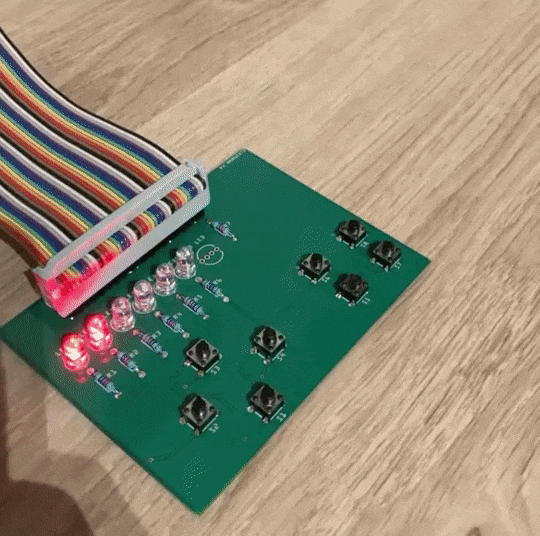
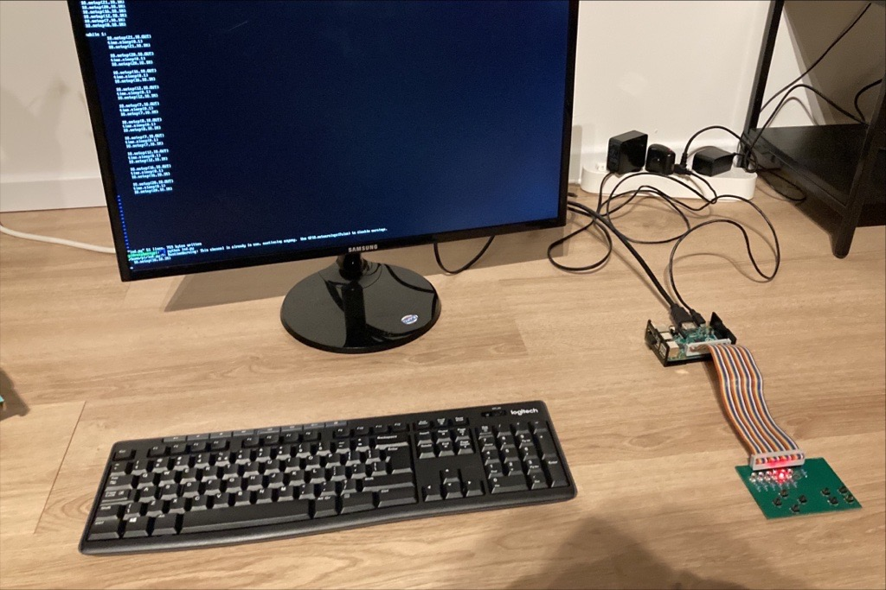

# Introduction
Learn python on the Raspberry PI using a GPIO board. This project is an example for learning very basic python using the Raspberry PI and an additional board to learn programming using python. 

This project includes:
* Schematics of the GPIO board
* Example lesson of learning python

# Examples
Using python on the raspberry pi it is possible to control the LEDs on the board and make some interesting patterns:

# Setup
The setup consists of: 
* A Raspberry PI with Raspbian Lite (No GUI)
* A 40 pin ribbon cable
* The GPIO board

